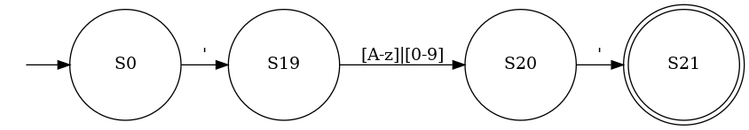
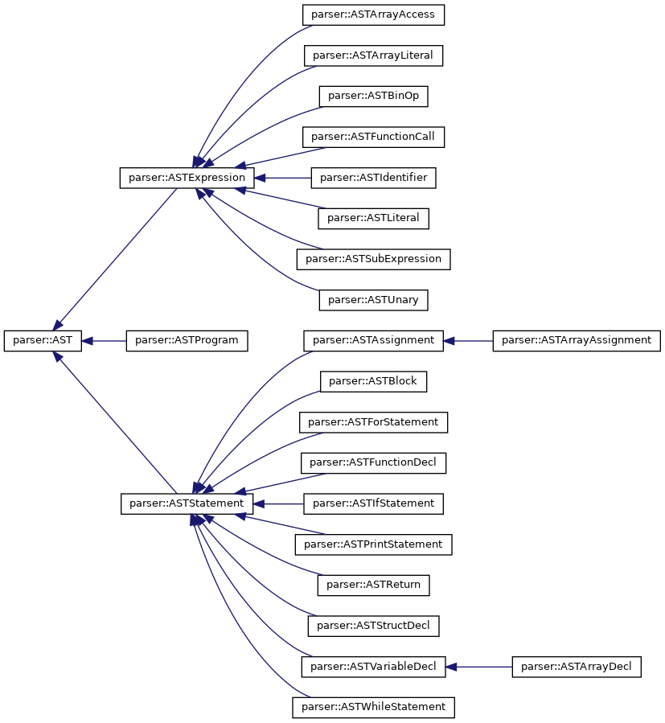

\newpage
\tableofcontents
\newpage


# Language Definition

Below is a copy of the Tealang EBNF with changes from TealangV1 and TealangV2 highlighted in blue.

\begin{grammar}

<Letter> ::= [A-Za-z]

<Digit> ::= [0-9]

<Printable> ::= [\textbackslash x20-\textbackslash x7E]

<Type> ::= `float' | `int' | `bool' | `string' \color{blue} |  `char' | `auto' \color{black}


<BooleanLiteral> ::= `true' | `false'

<IntegerLiteral> ::= <Digit> \{ <Digit> \}

<FloatLiteral> ::= <Digit> \{ <Digit> \} `.' <Digit> \{ <Digit> \}

\color{blue}
<CharLiteral> ::= ``' <Letter> | <Digit> `\''
\color{black}

<StringLiteral> ::= `"' \{ <Printable> \} `"'

<Literal> ::= <BooleanLiteral>
\alt <IntegerLiteral>
\alt <FloatLiteral>
\alt <StringLiteral>
\color{blue}
\alt <CharLiteral>
\alt <ArrayLiteral>
\color{black}

<Identifier> ::= ( `\_' | <Letter> )  \{ `\_' | <Letter> | <Digit> \}

\color{blue}
<ArrayLiteral> ::= `{' <Expression> \{ `,' <Expression> \} `}'

<ArrayAccess> ::= <Identifier> `[' <Expression> `]'
\color{black}

<MultiplicativeOp> ::= `*' | `/' | `and'

<AdditiveOp> ::= `+' | `-' | `or'

<RelationalOp> ::= `<' | `>' | `==' | `!=' | `<=' | `>='

<ActualParams> ::= <Expression> \{ `,' <Expression> \}

<FunctionCall> ::= <Identifier> `(' [ <ActualParams> ] `)'

<SubExpression> ::= `(' <Expression> `)'

<Unary> ::= ( `-' | `not' ) <Expression>

\color{blue}
<StructFunc> ::= <Identifier> `.' <Identifier> `(' <ActualParams> `)' 

<StructAccess> ::= <Identifier> `.' <Identifier>
\color{black}

<Factor> ::=  <Literal>
\alt <Identifier>
\alt <FunctionCall>
\alt <SubExpression>
\alt <Unary>
\color{blue}
\alt <ArrayAccess>
\alt <StructFunc>
\alt <StructAccess>
\color{black}

<Term> ::= <Factor> \{ <MultiplicativeOp> <Factor> \}

<SimpleExpression> ::= <Term> \{ <AdditiveOp> <Term> \}

<Expression> ::= <SimpleExpression> \{ <RelationalOp> <SimpleExpression> \}

<Assignment> ::= <Identifier> `=' <Expression>

\color{blue}
<ArrayAssign> ::= <Identifier> `[' <Expression> `]' `=' <Expression>
\color{black}

<VariableDecl> ::= `let' <Identifier> `:' <Type> `=' <Expression>

\color{blue}
<ArrayDecl> ::=  `let' <Identifier> `[' <Expression> `]' `:' <Type> [ `=' <ArrayLiteral> ]
\color{black}

\color{blue}
<StructDecl> ::= `let' <Identifier> `:' <Identifier> [ `=' <Expression> ]
\color{black}

<PrintStatement> ::= `print' <Expression>

<RtrnStatement> ::= `return' <Expression>

<IfStatement> ::= `if' `(' <Expression> `)' <Block> [ `else' <Block> ]

<ForStatement> ::= `for' `(' [ <VariableDecl> ] ';' <Expression> ';' [ <Assignment> ] `)' <Block>

<WhileStatement> ::= `while' `(' <Expression> `)' <Block>

<FormalParam> ::= <Identifier> `:' \color{blue} ( <Type> | <Identifier> ) \color{black}

<FormalParams> ::= <FormalParam> \{ `,' <FormalParam> \}

<FunctionDecl> ::= \color{blue} ( <type> | <Identifier> ) \color{black} <Identifier> `(' [ <FormalParams> ] `)' <Block>

\color{blue}
<StructDef> ::= `tlstruct' <Identifier> `{' \{ <VariableDecl> `;' | <FunctionDecl> \} `}'

<StructAssign> ::= <Identifier> `.' <Identifier> `=' <Expression>
\color{black}

<Statement> ::=	<VariableDecl> `;'
\alt <Assignment> `;'
\alt <PrintStatement> `;'
\alt <IfStatement>
\alt <ForStatement>
\alt <WhileStatement>
\alt <RtrnStatement> `;'
\alt <FunctionDecl>
\color{blue}
\alt <ArrayDecl>  `;'
\alt <StructDecl> `;'
\alt <StructDef>
\alt <StructAssign> `;'
\color{black}
\alt <Block>

<Block> ::= `{' \{ <Statement> \} `}'

<Program> ::= \{ <Statement> \}

\end{grammar}


\newpage

# Lexer

The lexer for Tealang is implemented using a table driver scanner [@eac-scanner]. A table driven scanner is an implementation of a backtracking finite state automaton, meaning that the lexer will attempt to recover to the last valid acceptance state if the error state is entered.


## Character Classes

Finite Automata transitions are triggered by reading characters and then using a look-up table to determine the new state. To reduce the complexity of the transition table (reduce the number of states) characters were grouped into character classes based on the needs of the lexer.


| Class Name  | Class Capture Group                            |
|-------------+------------------------------------------------|
| Digit       | Numbers: [0-9]                                 |
| Decimal     | Period/Decimal Point: .                        |
| Identifier  | ASCII Letters and Underscore                   |
| Comparison  | Angle Brackets                                 |
| Equals      | Equality Sign                                  |
| Bang        | Exclamation Mark                               |
| Punctuation | Brackets (Curly and Round), Semi/Normal Colons |
| FSlash      | Forward Slash Symbol                           |
| PlusMinus   | Plus and Minus symbol                          |
| Asterisk    | Asterisk Sign                                  |
| BSlash      | Backslash symbol                               |
| DQuote      | Captures double Quotes                         |
| SQuote      | Captures Single Quotes                         |
| Newline     | ASCII Newline character                        |
| Printable   | All printable ascii symbols 32-126             |

The character classes are implemented such that there is no overlap between any two classes except for the printable classification. The implementation of the character classifier is such that the *printable* class can assigned if the tests for other classes failed.

\newpage 
## Automaton components

### Identifiers and Keywords

Keywords are reserved identifiers used by the language. In Tealang the set of all keywords is a subset of all valid identifiers, and as such keyword identification is implemented as extension to identifier identification.

When an identifier token is identified it is passed through a map to determine and locate the corresponding keyword in logarithmic time. If no match is found then the token is classified as an identifier.

{.class width=35%}

### Integers and Floats

Observing the EBNF for the Tealang it can be seen that the definition for `float` is an extension of the definition for `int`. This allows the DFA for `float` to only require an extra 2 states which reduces the size of the transition table.

An important fact about the definitions is that both `float` and `int` can start with any number of zeros, this means that `00000123.0` and `000` are both valid. These do not cause error conditions inside the evaluation of any expression and follow the behaviour of `std::stoi` and `std::stof` from c++.

{.class width=60%}

### Chars

As of Tealang 2 the language now supports the `char` datatype. Currently the char data type does only supports alpha-numeric characters.

{.class width=50%}

### Relational Operators and Equality

{.class width=40%}

### Strings

Typically string literals in programming languages need to include features such as escaped sequences like `\n` for newline or `\t` for tab. Tealang implements a crude form of this wherein if a `\` character is received then the next *printable* character is accepted into the string by default.

Escaped sequences are evaluated after the entire string has been accepted by the lexer, where a regex find and replace is ran on all known escape codes. Codes which are not known to the language are left in their original form, meaning that `hello\"` would be printed as `hello"` whilst `hello\4` will be printed as `hello\4`.

{.class width=50%}

### Language Punctuation

Tealang makes use of a C-style syntax and as such required multiple single character tokens. The single characters required are defined by the *puncutation* character class. Since the DFA accepts multiple characters in the same state the accepted string is cast to a `char` to allow resolution using a `switch` to increase performance. 


{.class width=40%}


### Binary Operators


Tealang implements 4 base binary arithmetic operators [`+`, `-`, `*`, `/`]. The binary operators were implemented separately to the Punctuation recognition character class to allow for more flexibility to implement features such as increment (`++`), decrement (`--`) and exponentiation (`**`) in Tealang 2, however the features did not make it into the language specification. 

Since the character used for division is also used in the comment syntax the recognition of the token is implemented in the comment section of the DFA.

{.class width=40%}


### Comments

As previously mentioned Tealang has a C-style syntax and as such has C-style single and multiline comments. Single comments are denoted by `//` and continue till the end of the line, multiline comments are enclosed in `/**/` and will ignore anything inside the opening (`/*`) and closing brace (`*/`).


{.class width=80%}

\newpage


\clearpage

# Parser

The Tealang parser is implemented as an LL(k) parser, with more than one lookahead only used in a small number of situations. An example of which is determining if an identifier is for a variable or a function call. 

The implementation closely follows the one laid out in [@eac-parser]. The majority of the construction rules are implemented as functions inside the `Parser` class, where each function returns an node to be added to the Abstract syntax tree.

The first function to be called is `parse_program` which returns the entire AST when it has finished. Since a `program` is defined as a list of statements then we attempt to parse a `statement` until the end of file is reached.

```{.cpp eval=False}

ASTProgram *Parser::parse_program() {
  ASTProgram *node = new ASTProgram();
  do {
    node->statements.push_back(parse_statement());
  } while (curr_tok.type != lexer::tok_end);
  return node;
}
```

## Parsing Statements


The `parse_statement` function then uses switches over a first set to determine which production rule to use based on the lookahead token.

| Token Type   | Production Rule      |
|--------------|----------------------|
| `let`        | Variable Decleration |
| `print`      | Print Statement      |
| `return`     | Return Statement     |
| `if`         | If Statement         |
| `for`        | For Statement        |
| *identifier* | Assignment           |
| *type*       | Function Decleration |
| `{`          | Block                |
Table: First Set Production Rules

Once a `statement` node is reached the production rules are applied one by one. Single tokens are evaluated inside the function block, with other productions evaluated by calling the corresponding parse function. An example of this can be seen in the code snippet below.


```{.cpp eval=False}

ASTFunctionDecl *Parser::parse_function_decl() {

  ASTFunctionDecl *node = new ASTFunctionDecl();

// Determining the Return Type of the Function
  switch (curr_tok.type) {
    case lexer::tok_type_bool:
    node->type = tea_bool;
    break;
```

$\vdots$

```{.cpp eval=False}
  default:
    fail("Type Decleration");
  }

    // Determining the function name
  curr_tok = lex.getNxtToken();
  if (curr_tok.type != lexer::tok_iden) {
    fail("Identifier");
  }else{
    node->identifier = curr_tok.value;
  }
  
  // Checking for ( token
  curr_tok = lex.getNxtToken();
  if (curr_tok.type != lexer::tok_round_left) {
    fail("(");
  }

  // Parse Parameters
  node->arguments = parse_formal_params();

  // Checking for ) token
  if (curr_tok.type != lexer::tok_round_right) {
    fail(")");
  }

   // Checking for { token 
  curr_tok = lex.getNxtToken();
  if (curr_tok.type != lexer::tok_curly_left) {
    fail("{");
  }
  
  // Parsing Function Block
  node->body = parse_block();
  return node;
}

```

\newpage 

## Parsing Expressions

Expression parsing is implemented in a similar fashion to statement parsing, where single tokens are checked as needed and further productions are recursively called.


```{.cpp eval=False}

ASTExpression *Parser::parse_simple_expression() {
  ASTExpression *x = parse_term();
  if (curr_tok.type == lexer::tok_add_op) {
    ASTBinOp *node = new ASTBinOp();
    node->left = x;
    node->value = curr_tok.value;
    node->op = tok_to_op[curr_tok.value];
    node->right = parse_simple_expression(); // Recursive Evaluation
    return node;
  } else {
    return x;
  }
}

```

Expression parsing is also the only time in Tealang where a lookahead of more than 1 token is needed. When evaluating a factor the production rules for *Identifier*, *ArrayAccess*, and *FunctionCall* all share the same First token. To resolve this another lookahead token is used to check for the existence of a '`[`' or '`(`' token, the absence of which is interpreted as an identifier call.

```{.cpp eval=False}
 case lexer::tok_iden: {
    ll1_tok = lex.getNxtToken(); // Getting Extra Lookahead
    if (ll1_tok->type == lexer::tok_round_left) { /** Function Call */
      ASTFunctionCall *node = new ASTFunctionCall();
      node->name = curr_tok.value;
      node->args = parse_actual_params();
      curr_tok = lex.getNxtToken();
      ll1_tok.reset();
      return node;
    } else if (ll1_tok->type ==
               lexer::tok_square_left) { /**< Array Index Operation*/
      ASTArrayAccess *node = new ASTArrayAccess();
      node->name = curr_tok.value;
      node->index = parse_expression();
      curr_tok = lex.getNxtToken();
      ll1_tok.reset();
      return node;
    } else {
      ASTIdentifier *node = new ASTIdentifier(); /** Variable */
      node->name = curr_tok.value;
      curr_tok = ll1_tok.value();
      ll1_tok.reset();
      return node;
    }
    break;
  }
```

\newpage


## Abstract Syntax Tree

The Abstract Syntax tree for Tealang was implemented to leverage the Visitor design pattern [@visitor]. This allows poly-morphism to determine the type of the node and call the correct function automatically.

Each `parse_production` function inside the Parser returns a pointer to a new AST Node. This has an almost one to one mapping with the EBNF, where all *Statement* productions are a subclass of `ASTStatement` and all *Expression* productions are a subclass of `ASTExpression`. There are some  exceptions to this rule, with `ASTArrayAssignment` being implemented as a subclass of `ASTAssignment` due to the large amount of overlap and an identical First token. Another other exception is the *Expression*, *SimpleExpression*, and *Term* productions which are all implemented with the same `ASTBinOp` node. The full class diagram can be seen in Figure 11.


![Visitor Design Pattern [@wikivisitor]](diagrams/visitor.jpg)



\newpage

### XML Generation

To debug and analyse the output of the generated Abstract syntax tree an XML visitor was created. The visitor is able to traverse the tree and output semantically correct XML to the specified file. 

Each subclass of `ASTStatement` and `ASTExpression` have functions to output the information for the current node. Indentation is tracked in the `XMLVisitor` class where `indent()` and `unindent()` push and pop `\t` characters to a string buffer.

```{.cpp}
void XMLVisitor::visit(parser::ASTVariableDecl *x) {
  file << indentation << "<Decl>" << std::endl;
  indent();
  file << indentation << "<Var Type=\"" << x->Type << "\">" << x->identifier
       << "</Var>" << std::endl;
  indent();
  x->value->accept(this);
  unindent();
  unindent();
  file << indentation << "</Decl>" << std::endl;
}
```

### AST Generation Example

The following code snippet is a valid Tealang program which utilises a decent amount of the language features. The generated XML for this program is almost 100 lines long and as such only the XML for the `XGreaterThanY` function is included here. In the final section of this document is a testing section with the full output.

**Source Code**
```{.go eval=False}
bool XGreaterThanY(x: float, y:float) {
     let ans:bool = true;
     if (y>x) { ans = false; }
     return ans;
}

auto fib(a: int){
  if (a < 2) {
    return a;
  }
  return fib(a - 1) + fib(a - 2);
}

let x:float = 2.4;
let y:float = Square(2.5);
print x;                        //2.4
print y;                        //6.25
print XGreaterThanY(x,2.3);     //true
print fib(10);

```

\newpage

**XML for XGreaterThanY**
```{.xml}

<FuncDecl>
  <Var Type="2">XGreaterThanY</Var>
  <Arg Type="0">x</Arg>
  <Arg Type="0">y</Arg>
  <Block>
    <Decl>
      <Var Type="2">ans</Var>
        <BoolConst>true</BoolConst>
    </Decl>
    <If>
      <Condition>
        <BinExprNode Op="&gt;">
          <Identifier>y</Identifier>
          <Identifier>x</Identifier>
        </BinExprNode>
      </Condition>
      <EvalTrue>
        <Block>
          <Assign>
            <Var>ans</Var>
            <BoolConst>false</BoolConst>
          </Assign>
        </Block>
      </EvalTrue>
      <Else>
      </Else>
    </If>
    <Return>
      <Identifier>ans</Identifier>
    </Return>
  </Block>
</FuncDecl>

```

\newpage 

# Semantic Analysis

The goal of semantic analysis is to filter out the set of valid Tealang programs from the set of Tealang programs accepted by the EBNF.

## Type Checking

According to the specification of Tealang, the language is not to perform any implicit/automatic typecasting. As such all operations between variables are required to operate on the same types. 


\newpage

# Tealang Classes

The introduction of class based objects into the Tealang languaged required significant reworking of program internals. This was mainly related to the fact that now the *Identifier* token is being used in more situation. This causes First set conflicts and increases the need to use a look-ahead to determine the correct production. This rang true for both Expressions and Statements.

 | Production Rule          | Token Type             |
 |--------------------------|------------------------|
 | Variable Decleration     | `let`                  |
 | Array Decleration        | `let`                  |
 | Struct Decleration       | `let`                  |
 | Print Statement          | `print`                |
 | Return Statement         | `return`               |
 | If Statement             | `if`                   |
 | For Statement            | `for`                  |
 | Assignment               | *identifier*           |
 | Struct Member Assignment | *identifier*           |
 | Struct Definition        | `tlstruct`             |
 | Function Decleration     | *type* or *identifier* |
 | Block                    | `{`                    |
Table: First Set Production Rules with Structs


\clearpage
# References
