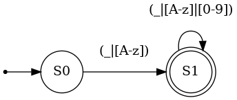
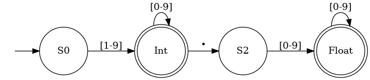
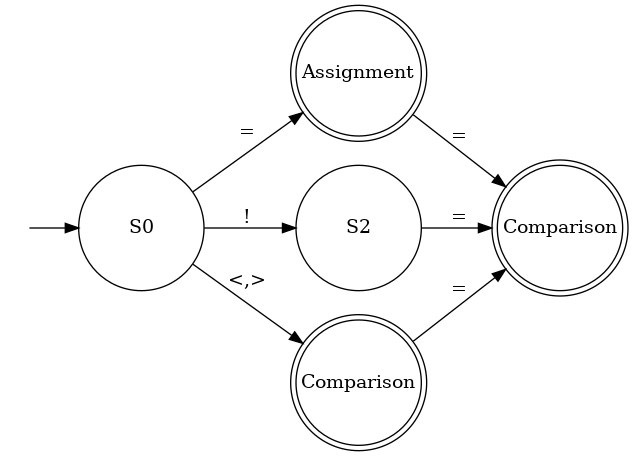
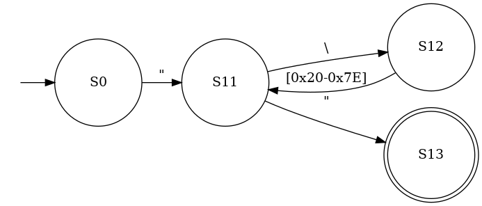
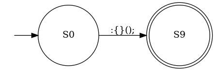
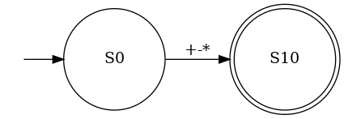
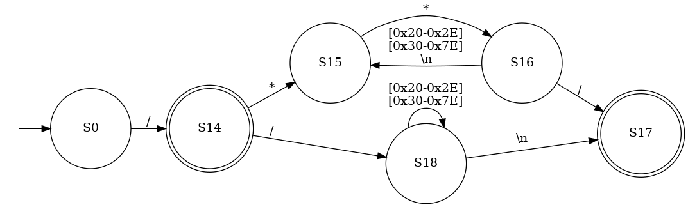
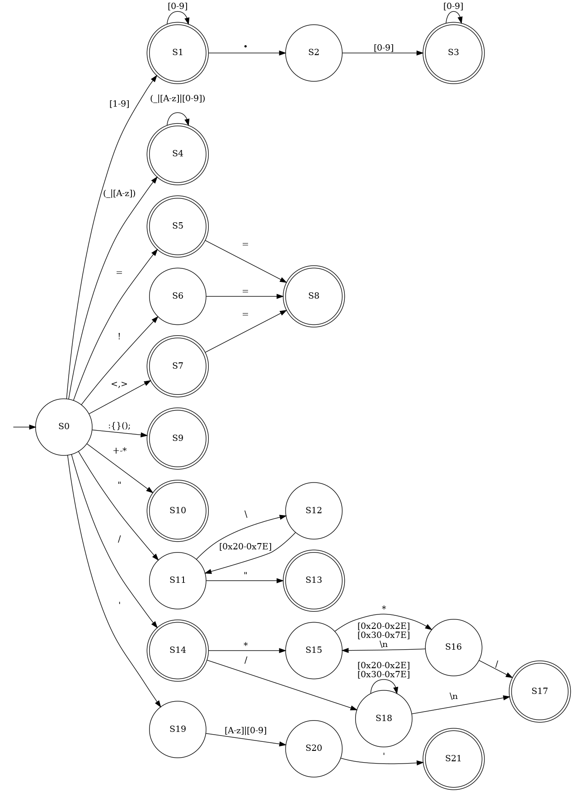
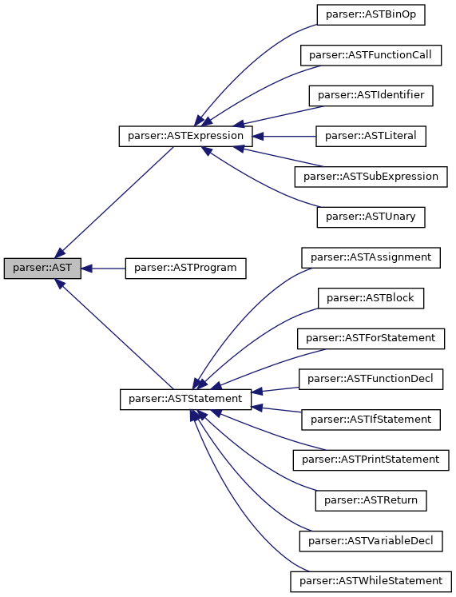

\newpage
\tableofcontents
\newpage

\pagenumbering{arabic}

\newpage

# Lexer

The lexer for Tealang is implemented using a table driver scanner [@eac-scanner]. A table driven scanner is an implementation of a backtracking finite state automaton, this means the lexer will attempt to recover to the last valid acceptance state if the error state is entered.


## Character Classes

Finite Automata transitions are triggered by reading characters and then using a look-up table to determine the new state. To reduce the complexity of the transition table (reduce the number of states) characters were grouped into character classes based on the needs of the lexer.


| Class Name  | Class Capture Group                            |
|-------------+------------------------------------------------|
| Digit       | Numbers: [0-9]                                 |
| Decimal     | Period/Decimal Point: .                        |
| Identifier  | ASCII Letters and Underscore                   |
| Comparison  | Angle Brackets                                 |
| Equals      | Equality Sign                                  |
| Bang        | Exclamation Mark                               |
| Punctuation | Brackets (Curly and Round), Semi/Normal Colons |
| FSlash      | Forward Slash Symbol                           |
| PlusMinus   | Plus and Minus symbol                          |
| Asterisk    | Asterisk Sign                                  |
| BSlash      | Backslash symbol                               |
| DQuote      | Captures double Quotes                         |
| SQuote      | Captures Single Quotes                         |
| Newline     | ASCII Newline character                        |
| Printable   | All printable ascii symbols 32-126             |

The character classes are implemented such that there is no overlap between any two classes except for the printable classification. The implementation of the character classifier is such that the *printable* class can assigned if the tests for other classes failed.

This approach does cause a degradation in performance as compared with implementing a transition for each ascii character, as an extra function call and a switch statement is required to deduce the character class. 


\newpage 
## Automaton components

### Identifiers and Keywords

Keywords are reserved identifiers used by the language. In Tealang the set of all keywords is a subset of all valid identifiers, and as such keyword identification is implemented as extension to identifier identification.

When an identifier token is identified it is passed through a map to determine and locate the corresponding keyword in logarithmic time. If no match is found then the token is classified as an identifier.

{.class width=35%}

### Integers and Floats

Observing the EBNF for the Tealang it can be seen that the definition for `float` is an extension of the definition for `int`. This allows the DFA for `float` to only require an extra 2 states which reduces the size of the transition table.

An important fact about the definitions is that both `float` and `int` can start with any number of zeros, this means that `00000123.0` and `000` are both valid. These do not cause error conditions inside the evaluation of any expression and follow the behaviour of `std::stoi` and `std::stof` from c++.

{.class width=60%}

### Relational Operators and Equality

{.class width=40%}

### Strings

Typically string literals in programming languages need to include features such as escaped sequences like `\n` for newline or `\t` for tab. Tealang implements a crude form of this wherein if a `\` character is received then the next *printable* character is accepted into the string by default.

Escaped sequences are evaluated after the entire string has been accepted by the lexer, where a regex find and replace is ran on all known escape codes. Codes which are not known to the language are left in their original form, meaning that `hello\"` would be printed as `hello"` whilst `hello\4` will be printed as `hello\4`.

{.class width=50%}

### Language Punctuation

Tealang makes use of a C-style syntax and as such required multiple single character tokens. The single characters required are defined by the *punctuation* character class. Since the DFA accepts multiple characters in the same state the accepted string is cast to a `char` to allow resolution using a `switch` to increase performance. 


{.class width=40%}


### Binary Operators


Tealang implements 4 base binary arithmetic operators [`+`, `-`, `*`, `/`]. The binary operators were implemented separately to the Punctuation recognition character class to allow for more flexibility to implement features such as increment (`++`), decrement (`--`) and exponentiation (`**`) in future versions of the language.

Since the character used for division is also used in the comment syntax the recognition of the token is implemented in the comment section of the DFA.

{.class width=40%}


### Comments

As previously mentioned Tealang has a C-style syntax and as such has C-style single and multiline comments. Single comments are denoted by `//` and continue till the end of the line, multiline comments are enclosed in `/**/` and will ignore anything inside the opening (`/*`) and closing brace (`*/`).


{.class width=80%}

\newpage



\clearpage

\begin{figure}
\[
  \begin{array}{ r || c | c | c | c | c | c | c | c | c | c | c | c | c | c | c }
     & 1 & 2 & 3 & 4 & 5 & 6 & 7 & 8 & 9 & 10 & 11 & 12 & 13 & 14 & 15 \\
    \hhline{================}
      S0 & S1 &  SE &  S4 &  S7 &  S5 &  S6 &  S9 &  S14 &  S10 &  S10 &  SE &  S11 &  SE &  SE &  SE \\
      S1  &  S1 &  S2 &  SE &  SE &  SE &  SE &  SE &  SE &  SE &  SE &  SE &  SE &  SE &  SE &  SE \\
      S2  &  S3 &  SE &  SE &  SE &  SE &  SE &  SE &  SE &  SE &  SE &  SE &  SE &  SE &  SE &  SE \\
      S3  &  S3 &  SE &  SE &  SE &  SE &  SE &  SE &  SE &  SE &  SE &  SE &  SE &  SE &  SE &  SE \\
      S4  &  S4 &  SE &  S4 &  SE &  SE &  SE &  SE &  SE &  SE &  SE &  SE &  SE &  SE &  SE &  SE \\
      S5  &  SE &  SE &  SE &  SE &  S8 &  SE &  SE &  SE &  SE &  SE &  SE &  SE &  SE &  SE &  SE \\
      S6  &  SE &  SE &  SE &  SE &  S8 &  SE &  SE &  SE &  SE &  SE &  SE &  SE &  SE &  SE &  SE \\
      S7  &  SE &  SE &  SE &  SE &  S8 &  SE &  SE &  SE &  SE &  SE &  SE &  SE &  SE &  SE &  SE \\
      S8  &  SE &  SE &  SE &  SE &  SE &  SE &  SE &  SE &  SE &  SE &  SE &  SE &  SE &  SE &  SE \\
      S9  &  SE &  SE &  SE &  SE &  SE &  SE &  SE &  SE &  SE &  SE &  SE &  SE &  SE &  SE &  SE \\
      S10  & SE &  SE &  SE &  SE &  SE &  SE &  SE &  SE &  SE &  SE &  SE &  SE &  SE &  SE &  SE \\
      S11  & S11 &  S11 &  S11 &  S11 &  S11 &  S11 &  S11 &  S11 &  S11 &  S11 &  S12 &  S13 &  SE &  S11 & SE \\
      S12  & S11 &  S11 &  S11 &  S11 &  S11 &  S11 &  S11 &  S11 &  S11 &  S11 &  S11 &  S11 &  SE &  S11 &  SE \\
      S13 &  SE &  SE &  SE &  SE &  SE &  SE &  SE &  SE &  SE &  SE &  SE &  SE &  SE &  SE &  SE \\
      S14 &  SE &  SE &  SE &  SE &  SE &  SE &  SE &  S18 &  SE &  S15 &  SE &  SE &  SE &  SE &  SE \\
      S15  &  S15 &  S15 &  S15 &  S15 &  S15 &  S15 &  S15 &  S15 &  S15 &  S16 &  S15 &  S15 &  S15 &  S15 &  SE \\
      S16  &  S15 &  S15 &  S15 &  S15 &  S15 &  S15 &  S15 &  S17 &  S15 &  S15 &  S15 &  S15 &  S15 &  S15 &  SE \\
      S17  &  SE &  SE &  SE &  SE &  SE &  SE &  SE &  SE &  SE &  SE &  SE &  SE &  SE &  SE &  SE \\
      S18  &  S18 &  S18 &  S18 &  S18 &  S18 &  S18 &  S18 &  S18 &  S18 &  S18 &  S18 &  S18 &  S17 &  S18 &  SE \\
      SE  &  SE &  SE &  SE &  SE &  SE &  SE &  SE &  SE &  SE &  SE &  SE &  SE &  SE &  SE &  SE 
  \end{array}
\]
\caption{Full State Transition Table}
\end{figure}

\clearpage

# Parser

The Tealang parser is implemented as an LL(k) parser, with more than one lookahead only used in a small number of situations. An example of which is determining if an identifier is for a variable or a function call. The implementation closely follows the one laid out in [@eac-parser]. The implementation works by creating parse functions for the various construction rules inside the EBNF. 

## Parsing Statements

Parsing statements requires the deduction of the correct production rule from a list of 8 possible productions. Since the grammar is LL(1) in this instance a lookahead table can be constructed and then switched over to call the correct production rule.

| Token Type   | Production Rule      |
|--------------|----------------------|
| `let`        | Variable Decleration |
| `print`      | Print Statement      |
| `return`     | Return Statement     |
| `if`         | If Statement         |
| `for`        | For Statement        |
| *identifier* | Assignment           |
| *type*       | Function Decleration |
| `{`          | Block                |
Table: First Set Production Rules

```{.cpp .numberLines}
ASTStatement *Parser::parse_statement() {
  switch (curr_tok.type) {
  case lexer::tok_let:
    return parse_var_decl();
    break;
 case lexer::tok_print:
    return parse_print();
    break;
  case lexer::tok_return:
    return parse_return();
    break;
  case lexer::tok_if:
    return parse_if();
    break;
```

\newpage

### Parsing a Function Decleration

If the first token in a statement production is a *type* then the `parse_function_decl` function will be called to evaluate the production.The function works by either checking the type of the incoming token, or calling the corresponding production rule. 

If the production rule fails at any step the `fail` function is called to provide the user with an error message, which includes the expected token, the token found, and the line number of the failure.


```{.cpp eval=False}

ASTFunctionDecl *Parser::parse_function_decl() {

  ASTFunctionDecl *node = new ASTFunctionDecl();

// Determining the Return Type of the Function
  switch (curr_tok.type) {
    case lexer::tok_type_bool:
    node->type = tea_bool;
    break;
```

$\vdots$

```{.cpp eval=False}
  default:
    fail("Type Decleration");
  }

    // Determining the function name
  curr_tok = lex.getNxtToken();
  if (curr_tok.type != lexer::tok_iden) {
    fail("Identifier");
  }else{
    node->identifier = curr_tok.value;
  }
  
  // Checking for ( token
  curr_tok = lex.getNxtToken();
  if (curr_tok.type != lexer::tok_round_left) {
    fail("(");
  }

  // Parse Parameters
  node->arguments = parse_formal_params();
```

\newpage 

## Parsing Expressions

Expression parsing is implemented in a similar fashion to statement parsing, where single tokens are checked as needed and further productions are recursively called.


```{.cpp eval=False}

ASTExpression *Parser::parse_simple_expression() {
  ASTExpression *x = parse_term();
  if (curr_tok.type == lexer::tok_add_op) {
    ASTBinOp *node = new ASTBinOp();
    node->left = x;
    node->value = curr_tok.value;
    node->op = tok_to_op[curr_tok.value];
    node->right = parse_simple_expression(); // Recursive Evaluation
    return node;
  } else {
    return x;
  }
}

```

Expression parsing is also the only time in Tealang where a lookahead of more than 1 token is needed. When evaluating a factor the production rules for *Identifier* and *FunctionCall* share the same first token. To resolve this another lookahead token is used to check for the existence of a  '`(`' token, the absence of which is interpreted as an identifier call.

```{.cpp eval=False}
case lexer::tok_iden: {
    ll1_tok = lex.getNxtToken();                    // Lookahead Token
    if (ll1_tok->type == lexer::tok_round_left) {   // Function Call
      ASTFunctionCall *node = new ASTFunctionCall();
      node->name = curr_tok.value;
      node->args = parse_actual_params();
      curr_tok = lex.getNxtToken();
      ll1_tok.reset();
      return node;
    } else {                                        // Identifier
      ASTIdentifier *node = new ASTIdentifier();
      node->name = curr_tok.value;
      curr_tok = ll1_tok.value();
      ll1_tok.reset();
      return node;
    }
    break;
}
```

\newpage


## Abstract Syntax Tree

The Abstract Syntax tree for Tealang was implemented to leverage the Visitor design pattern [@visitor]. This allows poly-morphism to determine the type of the node and call the correct function automatically, thus eliminating the need to store production numbers in the parent nodes .

![Visitor Design Pattern [@wikivisitor]](diagrams/visitor.jpg)

Each parse function inside of the Parser returns a pointer to the new AST node to be added to the tree. To increase code readability a class hierarchy was created, where all *Statement* productions extend the `ASTStatement` class, and all *Expression* productions extend the `ASTExpression` class. 


```{.cpp .numberLines}
class ASTFunctionCall : public ASTExpression {
public:
  std::string name;
  std::vector<ASTExpression *> args;
  inline void accept(visitor::Visitor *visitor) { visitor->visit(this); }
};
```


Not all production rules have their own class with *Expression*, *SimpleExpression*, and *Term* being prime examples. Since the production rules were created to implement order precedence, and this is fixed after parsing, then all the productions can be implemented using one class. This also helps to reduces the amount of code needed to write for the visitor later on.


```{.cpp .numberLines}
class ASTBinOp : public ASTExpression {
public:
  ASTExpression *left, *right;
  Operators op;
  std::string value;
  inline void accept(visitor::Visitor *visitor) { visitor->visit(this); }
};
```


{.class width=70% #fig:class-diagram}


\newpage

### XML Generation

To debug and analyse the output of the generated Abstract syntax tree an XML visitor was created. The visitor is able to traverse the tree and output semantically correct XML to the specified file. 

Each subclass of `ASTStatement` and `ASTExpression` have functions to output the information for the current node. Indentation is tracked in the `XMLVisitor` class where `indent()` and `unindent()` push and pop `\t` characters to a string buffer.

```{.cpp}
void XMLVisitor::visit(parser::ASTVariableDecl *x) {
  file << indentation << "<Decl>" << std::endl;
  indent();
  file << indentation << "<Var Type=\"" << x->Type << "\">" << x->identifier
       << "</Var>" << std::endl;
  indent();
  x->value->accept(this);
  unindent();
  unindent();
  file << indentation << "</Decl>" << std::endl;
}
```

### AST Generation Example

The following code snippet is a valid Tealang program which utilises a decent amount of the language features. The generated XML for this program is almost 100 lines long and as such only the XML for the `XGreaterThanY` function is included here. In the final section of this document is a testing section with the full output.

**Source Code**
```{.go eval=False}
bool XGreaterThanY(x: float, y:float) {
     let ans:bool = true;
     if (y>x) { ans = false; }
     return ans;
}

auto fib(a: int){
  if (a < 2) {
    return a;
  }
  return fib(a - 1) + fib(a - 2);
}

let x:float = 2.4;
let y:float = Square(2.5);
print x;                        //2.4
print y;                        //6.25
print XGreaterThanY(x,2.3);     //true
print fib(10);

```

\newpage

**XML for XGreaterThanY**
```{.xml}

<FuncDecl>
  <Var Type="2">XGreaterThanY</Var>
  <Arg Type="0">x</Arg>
  <Arg Type="0">y</Arg>
  <Block>
    <Decl>
      <Var Type="2">ans</Var>
        <BoolConst>true</BoolConst>
    </Decl>
    <If>
      <Condition>
        <BinExprNode Op="&gt;">
          <Identifier>y</Identifier>
          <Identifier>x</Identifier>
        </BinExprNode>
      </Condition>
      <EvalTrue>
        <Block>
          <Assign>
            <Var>ans</Var>
            <BoolConst>false</BoolConst>
          </Assign>
        </Block>
      </EvalTrue>
      <Else>
      </Else>
    </If>
    <Return>
      <Identifier>ans</Identifier>
    </Return>
  </Block>
</FuncDecl>

```

\newpage 

# Semantic Analysis

The goal of semantic analysis is to filter out the set of valid Tealang programs from the set of Tealang programs accepted by the EBNF.

## Variables

Tealang features a deceleration with assignment approach to variables, as such type checking needs to be performed during variable deceleration. The other instance in which type checking between variables and expression needs to be performed is during variable re-assignment.

Since the visitor functions are designed to return nothing, state must be stored inside the Visitor class. During expression evaluation the type is stored in `token_type` which can then be checked against the type of the variable.

```{.cpp .numberLines}
void SemanticVisitor::visit(parser::ASTVariableDecl *x) {
  auto var = res_var_local(x->identifier); // Checking if the variable is already declared in this scope
  if (var.has_value()) {
    throw std::invalid_argument(
        "Cannot redeclare variable with the same name in the same scope");
  } else {
    x->value->accept(this);
    if (token_type != x->Type) { // Checking for type compatibility
      throw std::invalid_argument(
          "Variable Declaration and Assignment have incompatible types");
    } else {
```


```{.cpp .numberLines}
void SemanticVisitor::visit(parser::ASTAssignment *x) {
  auto var = res_var_all(x->identifier); // Checking the variable has been initialised in any scope
  if (var.has_value()) {
    x->value->accept(this);
    if (var.value() != token_type) { // Checking the new type matches the initialised type
      throw std::invalid_argument("Variable assignment types dont match");
    }
  } else {
    throw std::invalid_argument("Variable not initialised");
  }
}
```

Another consideration during with variables is the current scope, variables can be re-declared so long as they are not within the same scope. To track this the `SemanticVisitor` class uses a stack of maps from variable name to variable type. The `res_var_all` function is used to check all scopes for the existence of a variable, and to return its type if found. The implementation of the function will always return the variable in the closest scope, as to be inline with the C programming language. `res_var_local` is used to check the existence of a variable in the current scope, this function is used when declaring new variables.

```{.cpp .numberLines}
std::vector<std::map<std::string, parser::Tealang_t>> variable_scope; 

std::optional<parser::Tealang_t> res_var_all(std::string); 
      
std::optional<parser::Tealang_t> res_var_local(std::string); 
```

\newpage

### Return Statements

Tealang's EBNF allows return statements to be called outside of function calls. To resolve this issue an optional variable `function_type` is used to determine if the return statement is being called inside of a function call. 

```{.cpp .numberLines}
std::optional<std::tuple<parser::Tealang_t, bool>> function_type; 
```

When a function deceleration node is encountered, `function_type` is set to a tuple containing the desired return type of the function and a false boolean. The boolean is used as a flag to check if the function returns, as return nodes are implemented to set the flag to true so long as their type matches. This one variable therefore implements both type checking for returns, failure for return statements outside of functions, and return guarantees for functions.

### Operators

Tealang is statically types language defined as having no implicit/automatic typecasting. As such typechecking is a rather simple implementation. The only point of note is to check the usage of operators between types, and to change the return type to a boolean when using relational operators

#### Type Checking

\

```{.cpp .numberLines}
void SemanticVisitor::visit(parser::ASTBinOp *x) {

  x->left->accept(this);
  parser::Tealang_t left = token_type.value();
  x->right->accept(this);
  parser::Tealang_t right = token_type.value();
  if (left != right) {
    throw std::invalid_argument(
        "Binary Operator Nodes can only work on same types");
  } else {
    switch (token_type.value()) {
```


#### Operator Checking 

The first switch is used to determine the type of the variables being operated upon, wherein a secondary switch is  used to check for cases where operators not defined on said types are being used.

```{.cpp .numberLines}
case parser::tea_float:
case parser::tea_int: {
      switch (x->op) { // Checking the operators
      case parser::op_and:
      case parser::op_or:
        throw std::invalid_argument(
            "Numerical types cannot be operated upon by boolean operators");
      default:
        // All other operators are valid, so do nothing
        break;
      }
      break;
    }
break;
}
```


#### Relational Operators

At the end of all the evaluation a final switch is used to update the return type when using relational operator nodes 

```{.cpp .numberLines}
switch (x->op) {
    case parser::op_and:
    case parser::op_or:
    case parser::op_less:
    case parser::op_grtr:
    case parser::op_eql:
    case parser::op_neql:
    case parser::op_le:
    case parser::op_ge:
      token_type = parser::tea_bool;
      break;
    default:
      break;
    }
```

#### Control Flow

`If`, `For`, and `While` statements all feature a conditional boolean expression to dictate control flow. This is checked by visiting the expression node and checking `token_type` is a boolean expression.


\newpage

# Interpreter

The interpreter implementation for Tealang is designed around the traversal and evaluation of the AST. This does cause significant performance degradation as compared with a bytecode based implementation, however performance was not the main aim of the assignment.

## Changes from Semantic Analysis

The scope, variable and function representation from the semantic analyser were overhauled and improved for the interpreter as new problems such as stack frames became an issue. Functions relating to scope checking were also removed as the interpreter works with the assumption of a correct input program.

### Variables

```{.cpp .numberLines}
class Variable {
public:
  parser::Tealang_t var_type;
  std::string name;
  std::any value; /**< Using the enum for the get*/
};
```

Variables are now represented by a `Variable` class, with the value stored in a C++ `any`. The `any` class is self descriptive in that *any* value can be stored inside of it. To get back the value of the `any` it must be cast back to the original type which is tracked using the `var_type` variable.

### Functions

```{.cpp .numberLines}
class Function {
public:
  std::string name;
  parser::Tealang_t return_type;
  std::vector<std::tuple<std::string, parser::Tealang_t>> arguments;
  parser::ASTBlock *function_body;
};
```

Functions are represented by the `Function` class, and store the same information as the interpreter such as arguments and return types. The new piece of information is the `function_body` variable, which points to the code block to be executed on function call. 

### Scope

```{.cpp .numberLines}
class Scope {
public:
  Function get_func(std::string); /**< Finds Function*/

  Variable get_var(std::string); /**< Find variable starting from top scope */

  void update_var(std::string, Variable); /**< Updates a variable starting from top scope*/

  void add_var(Variable);
  
  bool function_call;
```

Scope is now also represented by a class, with functions to find variables or functions, as well as adding or updating variables in the scope.

## Code Evalation

### Operator Evaluation

With types and operator validity being checked by the semantic analyser, operator evaluation is as simple as casting to the correct type and calling the operator. The values are then stored in the `token_value` variable found in the `Interpreter` class.

```{.cpp .numberLines}
void Interpreter::visit(parser::ASTBinOp *x) {

  x->left->accept(this);
  parser::Tealang_t left_type = token_type;
  auto left_val = token_value;
  x->right->accept(this);
  parser::Tealang_t right_type = token_type;

switch (left_type) {
  case parser::tea_bool: {
    switch (x->op) {
    case parser::op_eql:
      token_value =
          std::any_cast<bool>(left_val) == std::any_cast<bool>(right_val);
      break;
    case parser::op_neql:
      token_value =
          std::any_cast<bool>(left_val) != std::any_cast<bool>(right_val);
        break;
```

### Literal Evaluation

Literal evaluation involves the conversion of string types into floats, integers or booleans. This is handled neatly through the c++ STL with `stoi` handling conversion to integers, and `stof` handling conversion to floats. Usage of `stoi` and `stof` allows for `0` initialised literals to be properly handled, as they are deemed valid by the EBNF. Booleans are evaluated using the `boolalpha` stream modifier, the implementation of which causes any string except `"true"` to evaluate to false.

\newpage

### Function Evaluation

When evaluating function calls a global flag is used to determine if the current function call is the first call, or a recursive one. Initial function calls are required to create a new variable scope and push it to the scope stack. Recursive function calls need to first remove their parents scope, create their own variable scope and execute, before removing their own scope and placing their parents scope back onto the stack.

The reasoning behind having recursive function calls remove the parent scope was to allow functions to access global variables. This behaviour is important for both recursive functions like generating the Fibonacci numbers, or iterative functions referencing one another.


```{.cpp .numberLines}
#include <iostream>

int global = 10;

void bar(){
  std::cout << global << std::endl;
}

void foo(){
  int global = 12;
  bar();
}

int main(void) {
  foo();
}
```

The function `bar` is designed to print the variable `global` which is initialised to 10. The function `foo` is designed to create a new variable called `global` initialised to 12, and then call the `bar` function. 
 
If the `bar` function is able to access the scope created when `foo` was called, then the result from `bar` would be 12. Compiling and running this code reveals that the actual result is 10, meaning that calling a function from inside function will remove the parents scope.


\newpage

# Testing

## Function Call


### Source Code

```{.c .numberLines}
float Square(x:float){
      return x*x;
}

let y:float = Square(2.5);
print y;                        //6.25
```


### Code Output

```
6.25
```


### Generated AST 

```{.xml}
<?xml version="1.0" encoding="UTF-8"?>
<root description="Tealang AST Generation">
	<Prog>
		<FuncDecl>
			<Var Type="0">Square</Var>
			<Arg Type="0">x</Arg>
			<Block>
				<Return>
					<BinExprNode Op="*">
						<Identifier>x</Identifier>
						<Identifier>x</Identifier>
					</BinExprNode>
				</Return>
			</Block>
		</FuncDecl>
		<Decl>
			<Var Type="0">y</Var>
				<FuncCall Id="Square">
					<FloatConst>2.5</FloatConst>
				</FuncCall>
		</Decl>
		<Print>
			<Identifier>y</Identifier>
		</Print>
	</Prog>
</root>

```
\newpage

## Recursive Functions

### Source Code

```{.c .numberLines}
int fib(a: int){
  if (a < 2) {
    return a;
  }
  return fib(a - 1) + fib(a - 2);
}

print fib(7);
```

### Interpreter Output

```
13
6765
832040
```


### Generated XML

```{.xml}
<?xml version="1.0" encoding="UTF-8"?>
<root description="Tealang AST Generation">
	<Prog>
		<FuncDecl>
			<Var Type="1">fib</Var>
			<Arg Type="1">a</Arg>
			<Block>
				<If>
					<Condition>
						<BinExprNode Op="&lt">
							<Identifier>a</Identifier>
							<IntConst>2</IntConst>
						</BinExprNode>
					</Condition>
					<EvalTrue>
						<Block>
							<Return>
								<Identifier>a</Identifier>
							</Return>
						</Block>
					</EvalTrue>
					<Else>
					</Else>
				</If>
				<Return>
					<BinExprNode Op="+">
						<FuncCall Id="fib">
							<BinExprNode Op="-">
								<Identifier>a</Identifier>
								<IntConst>1</IntConst>
							</BinExprNode>
						</FuncCall>
						<FuncCall Id="fib">
							<BinExprNode Op="-">
								<Identifier>a</Identifier>
								<IntConst>2</IntConst>
							</BinExprNode>
						</FuncCall>
					</BinExprNode>
				</Return>
			</Block>
		</FuncDecl>
		<Print>
			<FuncCall Id="fib">
				<IntConst>7</IntConst>
			</FuncCall>
		</Print>
		<Print>
			<FuncCall Id="fib">
				<IntConst>20</IntConst>
			</FuncCall>
		</Print>
		<Print>
			<FuncCall Id="fib">
				<IntConst>30</IntConst>
			</FuncCall>
		</Print>
	</Prog>
</root>

```

\newpage


## Looping Functions

### Source Code

```{.c .numberLines}
string OverUnder50(age: int){
    if(age<50){
        return "UnderFifty";
    }else{
        return "OverFifty";
    }
}

let z:int = 45;

while(z<50){
	print OverUnder50(z); //"UnderFifty"x5
	z=z+1;
}

print OverUnder50(z); //"OverFifty"

for(let i:int = 0; i<5; i=i+1){
	print i;
}
```


### Interpreter Output

```
UnderFifty
UnderFifty
UnderFifty
UnderFifty
UnderFifty
OverFifty
0
1
2
3
4

```


### Generated AST

```{.xml}
<?xml version="1.0" encoding="UTF-8"?>
<root description="Tealang AST Generation">
	<Prog>
		<FuncDecl>
			<Var Type="3">OverUnder50</Var>
			<Arg Type="1">age</Arg>
			<Block>
				<If>
					<Condition>
						<BinExprNode Op="&lt">
							<Identifier>age</Identifier>
							<IntConst>50</IntConst>
						</BinExprNode>
					</Condition>
					<EvalTrue>
						<Block>
							<Return>
								<StringConst>UnderFifty</StringConst>
							</Return>
						</Block>
					</EvalTrue>
					<Else>
						<Block>
							<Return>
								<StringConst>OverFifty</StringConst>
							</Return>
						</Block>
					</Else>
				</If>
			</Block>
		</FuncDecl>
		<Decl>
			<Var Type="1">z</Var>
				<IntConst>45</IntConst>
		</Decl>
		<While>
			<Condition>
				<BinExprNode Op="&lt">
					<Identifier>z</Identifier>
					<IntConst>50</IntConst>
				</BinExprNode>
			</Condition>
			<EvalTrue>
				<Block>
					<Print>
						<FuncCall Id="OverUnder50">
							<Identifier>z</Identifier>
						</FuncCall>
					</Print>
					<Assign>
						<Var>z</Var>
						<BinExprNode Op="+">
							<Identifier>z</Identifier>
							<IntConst>1</IntConst>
						</BinExprNode>
					</Assign>
				</Block>
			</EvalTrue>
		</While>
		<Print>
			<FuncCall Id="OverUnder50">
				<Identifier>z</Identifier>
			</FuncCall>
		</Print>
		<For>
			<Decl>
				<Var Type="1">loopvar</Var>
					<IntConst>0</IntConst>
			</Decl>
			<Condition>
				<BinExprNode Op="<">
					<Identifier>loopvar</Identifier>
					<IntConst>5</IntConst>
				</BinExprNode>
			</Condition>
			<Assign>
				<Var>loopvar</Var>
				<BinExprNode Op="+">
					<Identifier>loopvar</Identifier>
					<IntConst>1</IntConst>
				</BinExprNode>
			</Assign>
			<EvalTrue>
				<Block>
					<Print>
						<Identifier>loopvar</Identifier>
					</Print>
				</Block>
			</EvalTrue>
		</For>
	</Prog>
</root>
```

\newpage

## Branching Code

### Source Code

```{.c .numberLines}
float Pow(x:float, n:int){
    let y:float = 1.0;
    if(n>0){
        for(;n>0;n=n-1){
            y = y * x;
        }
    }else{
        for(;n<0;n=n-1){
            y = y/x;
        }
    }
    return y;
}

let temp:float = Pow(2.1,10);
print temp; //prints to console 1667.988
```

### Interpreter Output

```
1667.99
```


### Generated XML

```{.xml}
<?xml version="1.0" encoding="UTF-8"?>
<root description="Tealang AST Generation">
	<Prog>
		<FuncDecl>
			<Var Type="0">Pow</Var>
			<Arg Type="0">x</Arg>
			<Arg Type="1">n</Arg>
			<Block>
				<Decl>
					<Var Type="0">y</Var>
						<FloatConst>1.0</FloatConst>
				</Decl>
				<If>
					<Condition>
						<BinExprNode Op=">">
							<Identifier>n</Identifier>
							<IntConst>0</IntConst>
						</BinExprNode>
					</Condition>
					<EvalTrue>
						<Block>
							<For>
								<Condition>
									<BinExprNode Op=">">
										<Identifier>n</Identifier>
										<IntConst>0</IntConst>
									</BinExprNode>
								</Condition>
								<Assign>
									<Var>n</Var>
									<BinExprNode Op="-">
										<Identifier>n</Identifier>
										<IntConst>1</IntConst>
									</BinExprNode>
								</Assign>
								<EvalTrue>
									<Block>
										<Assign>
											<Var>y</Var>
											<BinExprNode Op="*">
												<Identifier>y</Identifier>
												<Identifier>x</Identifier>
											</BinExprNode>
										</Assign>
									</Block>
								</EvalTrue>
							</For>
						</Block>
					</EvalTrue>
					<Else>
						<Block>
							<For>
								<Condition>
									<BinExprNode Op="<">
										<Identifier>n</Identifier>
										<IntConst>0</IntConst>
									</BinExprNode>
								</Condition>
								<Assign>
									<Var>n</Var>
									<BinExprNode Op="-">
										<Identifier>n</Identifier>
										<IntConst>1</IntConst>
									</BinExprNode>
								</Assign>
								<EvalTrue>
									<Block>
										<Assign>
											<Var>y</Var>
											<BinExprNode Op="/">
												<Identifier>y</Identifier>
												<Identifier>x</Identifier>
											</BinExprNode>
										</Assign>
									</Block>
								</EvalTrue>
							</For>
						</Block>
					</Else>
				</If>
				<Return>
					<Identifier>y</Identifier>
				</Return>
			</Block>
		</FuncDecl>
		<Decl>
			<Var Type="0">temp</Var>
				<FuncCall Id="Pow">
					<FloatConst>2.1</FloatConst>
					<IntConst>10</IntConst>
				</FuncCall>
		</Decl>
		<Print>
			<Identifier>temp</Identifier>
		</Print>
	</Prog>
</root>
```

\newpage


\clearpage
# References
